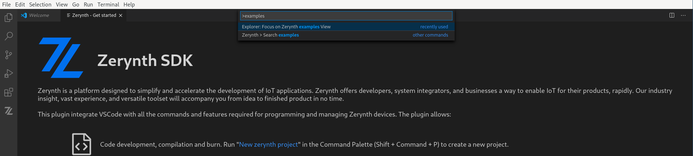

# Getting Started with 4ZeroBox

So you have a shiny new 4ZeroBox and would like to start playing with it?
First, you need to install the [Zerynth SDK](index.md#1-install-zerynth), it takes just a couple of minutes.

When the SDK is installed, you can run Visual Studio Code that comes already configured with our Zerynth extension.

Using the 4ZeroBox with the SDK is really easy

## 1. Create a project

Before connecting the 4ZeroBox a project must be created. 
Zerynth SDK provides a lot of examples that can be easily cloned and used as a starting point for a new project.

Just press `Ctrl+Shift+P` and type `examples` in the popup that VSCode displays.
<figure>
  
</figure>
The popup is the VSCode command palette from which most of the available operations can be launched.
Simply choose `Zerynth > Search examples` and then type `Hello`. Select the `Hello_World` example and provide a folder to clone it from its repository as shown in the figures below. When ready, click `Clone Zerynth Example` and you are good to go.

TODO: figure of cloning

## 2. Connect and configure the 4ZeroBox

Connect the 4ZeroBox with a USB-C cable to the development machine. The VSCode extension provides a panel labeled *Zerynth Control Panel* that contains information about the current project.

Press *Physical Device* and the Zerynth SDK will automtically recognize the 4ZeroBox and configure the project accordingly.

TODO: figure of Zerynth control panel with and without connected device

## 3. Run the example

Check the project for errors by pressing *Build*. If everything is ok, you can press *Run*. The Zerynth SDK compiles the source files, creates a binary firmware and moves it into the 4ZeroBox.

Just press *Console* and the serial output of 4ZeroBox will appear in the VSCode terminal.

TODO: add screenshots

## 4. Explore Zerynth!

Zerynth can do much more than a simple Hello World, for additional examples refer to:

- [Zerynth in 5 minutes](index.md#2-create-your-first-iot-project)
- [4ZeroBox Reference](../hardware/4ZeroBox.md)
- TODO: tutorial 1
- TODO: tutorial 2
