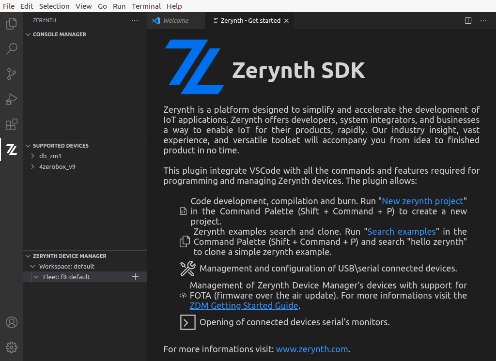
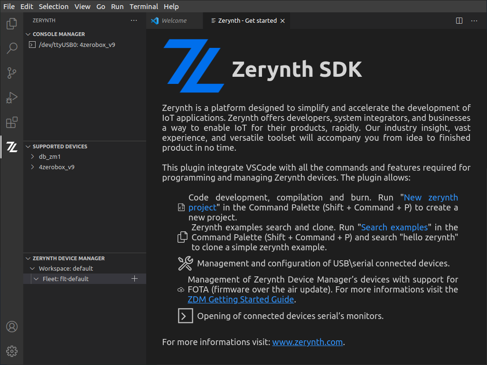
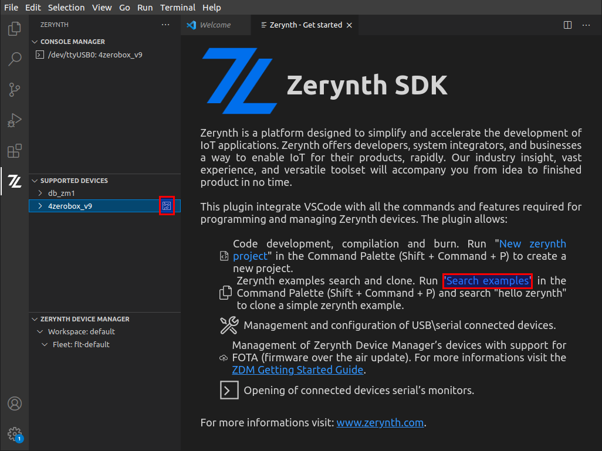
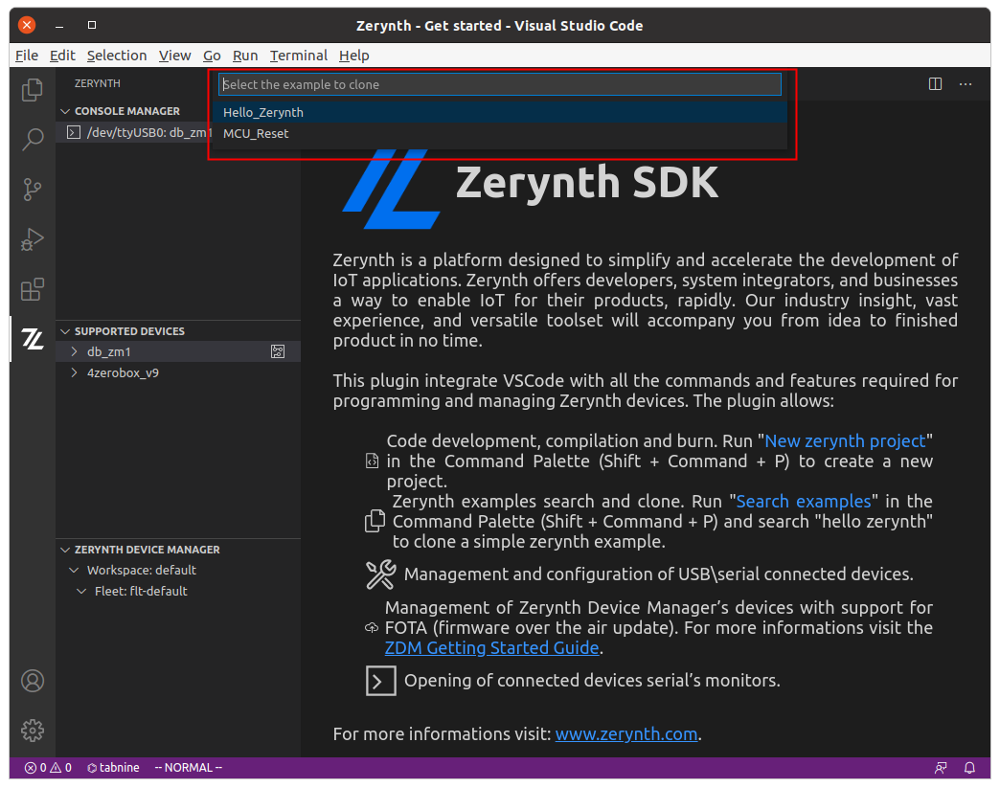
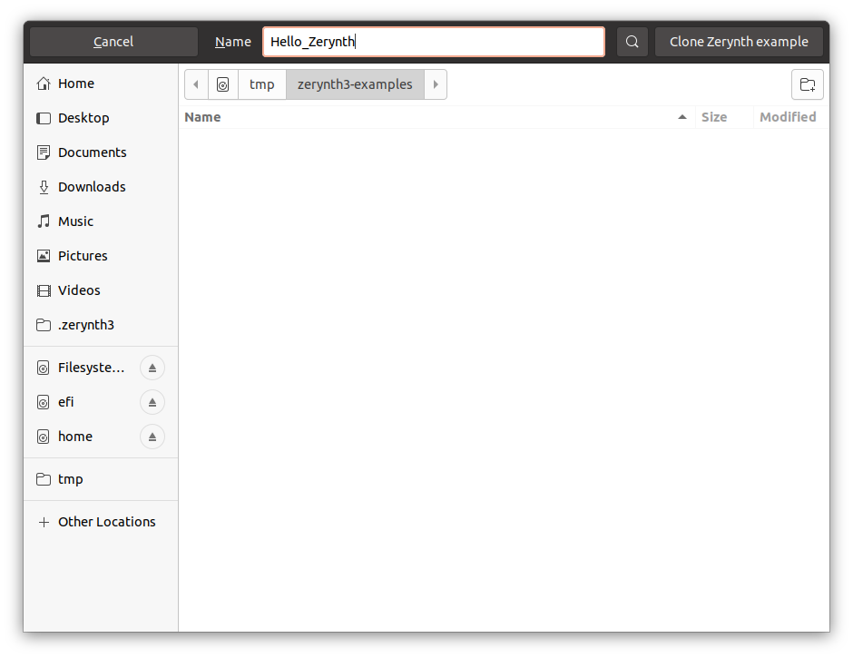
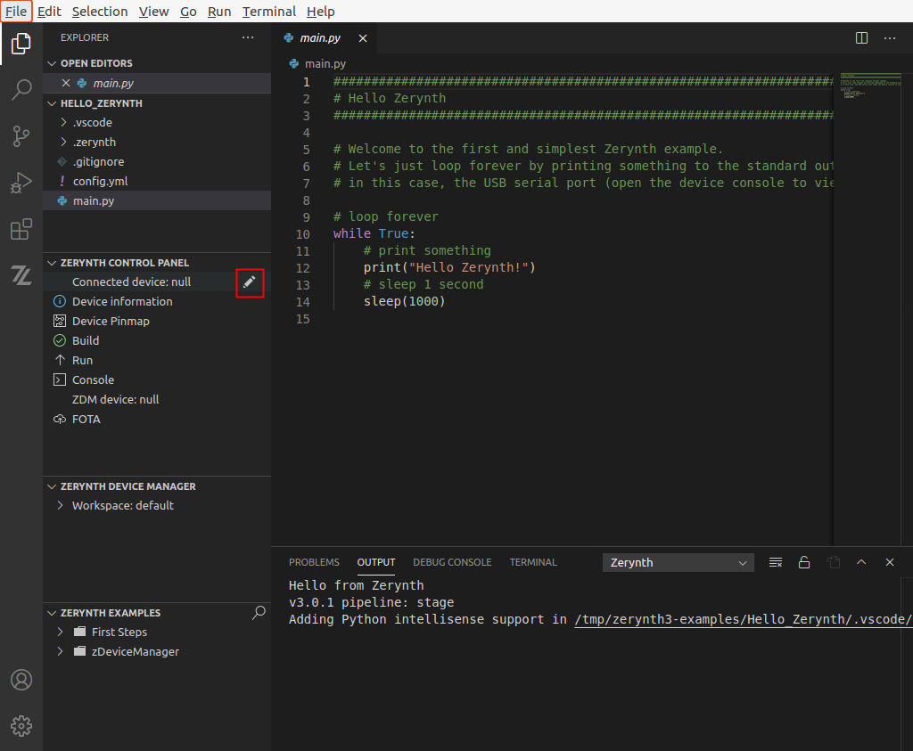
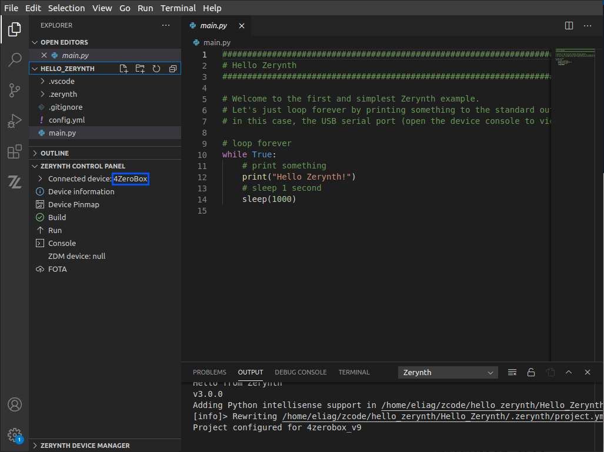
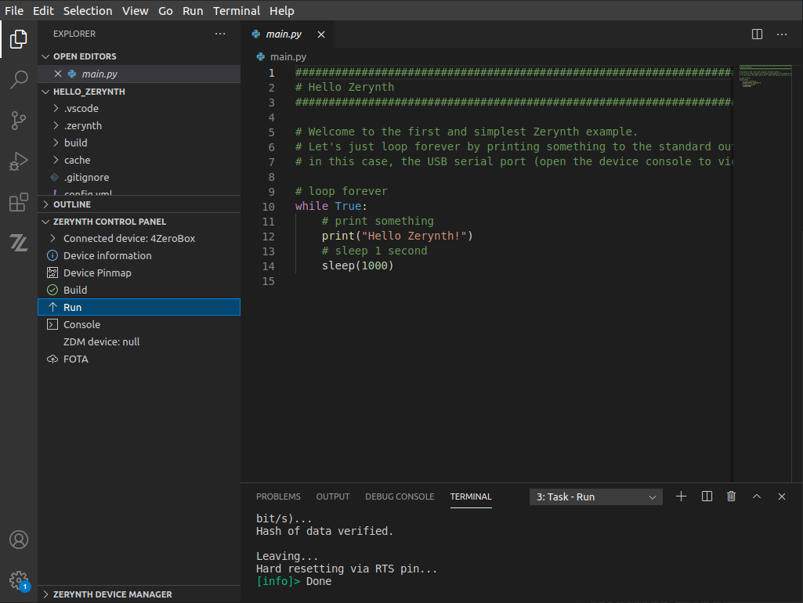
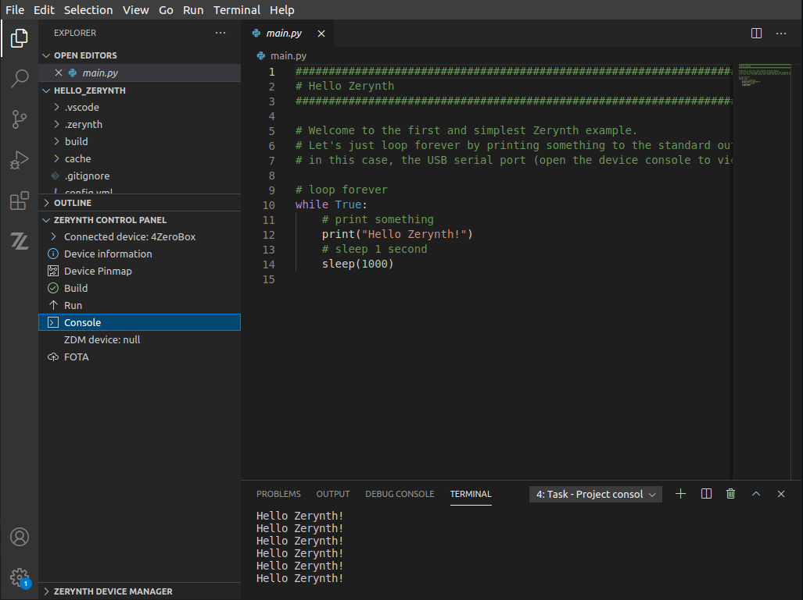

# Getting Started with 4ZeroBox

## 'Hello Zerynth' example

In the following the 'Hello Zerynth' example is explained step-by-step using the VSCode IDE.
The assumption is that Zerynth VSCode extention is installed and the user is logged in to the ZDM.

Once VSCode has been started, the screen is like the following

### 4ZeroBox connection and auto detection

By connecting the 4ZeroBox to the PC, it will be autodetected and the board type
shown in the Zerynth extension *Console Manager* section.

In the image above, the board was connected to a linux system and it was
detected on `/dev/ttyUSB0` port as *4ZeroBox_V9*

Into *Supported Device* section a list of supported board is visible. By clicking on the related link item, shown in the following image, the board documentation is opened in the web browser.

### Zerynth Examples

By clicking on *Search examples*, as shown in the previous image, the search dialog appears in the Command Line on the top of VSCode window.
Typing 'hello' the *Hello_Zerynth* example appears.

Selecting it, VSCode asks for a directory where a related git repository gets cloned:

The example repository gets cloned locally and the project is opened into VSCode, as shown in the following image.

### Project build and run

At this point the board has to be connected to the project by clicking on the
'pen' icon in the *Zerynth Control Panel* at *Connected devices* line. The
board type is auto detected and displayed as shown in the following image

The project can be built, uploaded onto the board and started by clicking on the *Run* voice of *Zerynth Connected Panel*.

The terminal shows the building and uploading process logs.

In order to see the 4ZeroBox console running the project, the user can click on *Console* voice of *Zerynth Connected Panel*.

and the *Terminal* window shows the live console updates.
