# **Zerynth in 5 minutes**

## **What is Zerynth?**
Zerynth is a complete software-hardware platform, It simplifies the development of IoT products by offering modular industrial development boards, production-ready SoC modules and Easy-to-use Python enabled development enviornment.
Zerynth hardware integrates seamlessly with Zerynth cloud, a powerful cloud service that monitors, manages and provisions devices, issues OTAs and procedure calls and visualize data with clear dashboards for the end-user. 

TODO: Picture of Zerynth as a platform.

To get started, You need one of Zerynth development boards, check the boards and Buy them from our hardware page.

## **Get Started**

This 5 minutes tutorial will show you how to connect your Zerynth hardware, use our VScode extension and start sending data to the cloud.

In 4 steps we'll go from zero to sending data securely to the cloud.

1. Install Zerynth
2. Create your first IoT project
3. Prepare the device for the cloud
4. Send data!

## **1. Install Zerynth**

Zerynth installer is an all-in-one application that installs the Zerynth operating system that will be used on the development board, the Zerynth compiler and the VSCode plugin that enables easy and efficient software development.
Zerynth installer supports Windows, Mac and linux.
You can download it from these links:

- [**Windows 10**](https://downloads.zerynth.com/v3/installer/zerynth-installer.exe)
- [**Linux**](https://downloads.zerynth.com/v3/installer/zerynth-installer.AppImage)
- [**Mac**](https://downloads.zerynth.com/v3/installer/zerynth-installer.dmg)

Once downloaded, simply run it and follow the instructions. The installer is run differently depending on your platform.

#### Installing for Windows

Double click the `zerynth-installer.exe` you just downloaded. The first time Windows may pop up a dialog saying that
the application is signed by Zerynth; just click continue to go on with the execution. It is possible that Windows will present you 
a blue dialog title "Windows protected your PC"; in that case, just click "more info" and run the installer.

<figure>
  <a data-fancybox="gallery" href="img/windows-screen.png">
  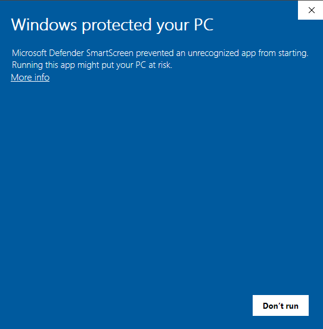
  </a>
  <figcaption>Windows Smartscreen warning</figcaption>
</figure>

#### Installing for Linux

The `zerynth-installer.AppImage` file you just downloaded can be executed in some distributions with a simple double click. However,
in general you may need to give execution permissions to the file before running it. This is done from a terminal with the command `chmod 755 <path-to-zerynth-installer>`.

<figure>
  <a data-fancybox="gallery" href="img/installer-linux-01.png">
  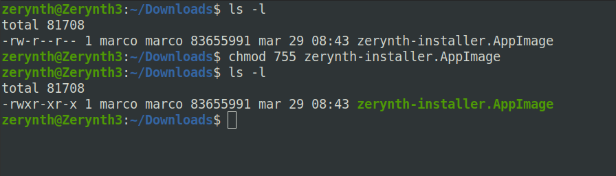
  </a>
</figure>

#### Installing for Mac

The `zerynth-installer.dmg` archive you just downloaded can be double clicked and mounted on the Finder. Just drag the `zerynth-installer` app contained within to the `Applications` folder. Next, click on `Applications` and run the `zerynth-installer` app.

<figure>
  <a data-fancybox="gallery" href="img/installer-mac-01.png">
  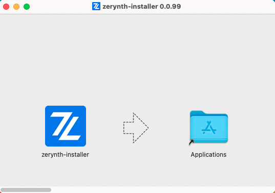
  </a>
</figure>

### Install the Zerynth SDK

The installer will install the **Zerynth SDK** in your development machine in a few steps. If you encounter any error please refere to our [Installer FAQ](../reference/faq/installer.md).

<figure>
  <a data-fancybox="gallery" href="img/installer-01.png">
  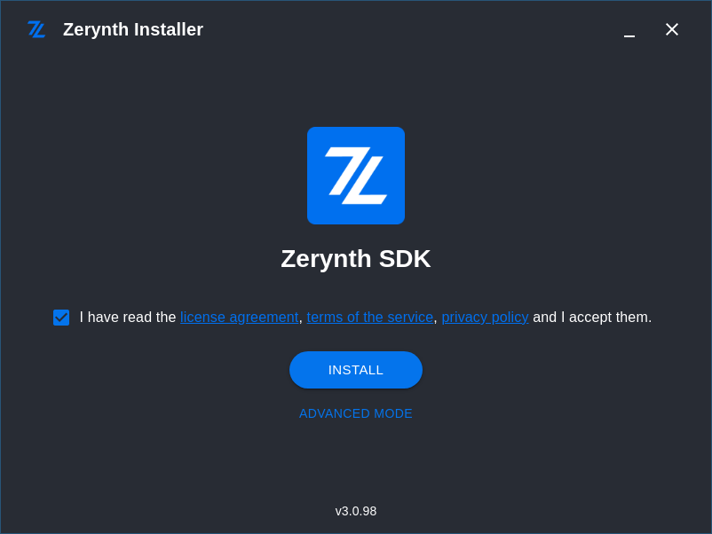
  </a>
</figure>

First, accept the license and terms and press `Install`. This will install the latest version of the SDK together with Visual Studio Code (a.k.a. VSCode) and the [VSCode Zerynth Extension](https://marketplace.visualstudio.com/items?itemName=zerynth.zerynth3).

<figure>
  <a data-fancybox="gallery" href="img/installer-02.png">
  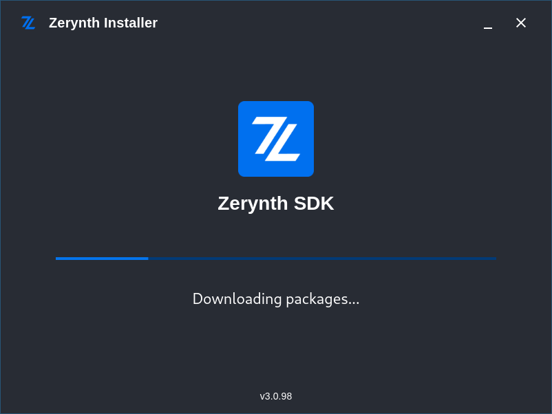
  </a>
</figure>
The installer will do its magic and in a couple of minutes will ask you to login to the Zerynth platform.

<figure>
  <a data-fancybox="gallery" href="img/installer-03.png">
  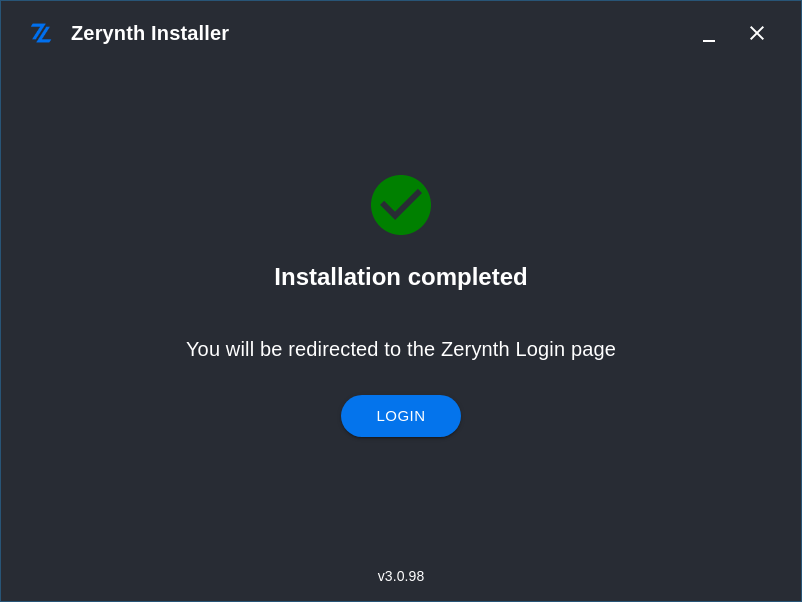
  </a>
</figure>

The login is done in your web browser and if everything is ok, you can go back to the installer and start VSCode!

<figure>
  
</figure>

## 2. Create your first IoT project

VSCode, together with the VSCode Zerynth extension, is our default development enviroment. We spent quite a lot of effort to make it as user-friendly as possible, hope you enjoy! Let us show how easy it is.

### Clone an example

Let's create your first project by cloning an existing example.

Just press `Ctrl+Shift+P` and type `examples` in the popup that VSCode displays. 
<figure>
  
</figure>

The popup is the VSCode command palette from which most of the available operations (called tasks in the VSCode jargon) can be launched.
Simply choose `Zerynth > Search examples` and then type `ZDM_`. Select the `ZDM_Simple` example and provide a folder to clone it from its repository as shown in the figures below. When ready, click `Clone Zerynth Example` and you are good to go.

<figure>
  <a data-fancybox="gallery" href="img/project-02.png">
  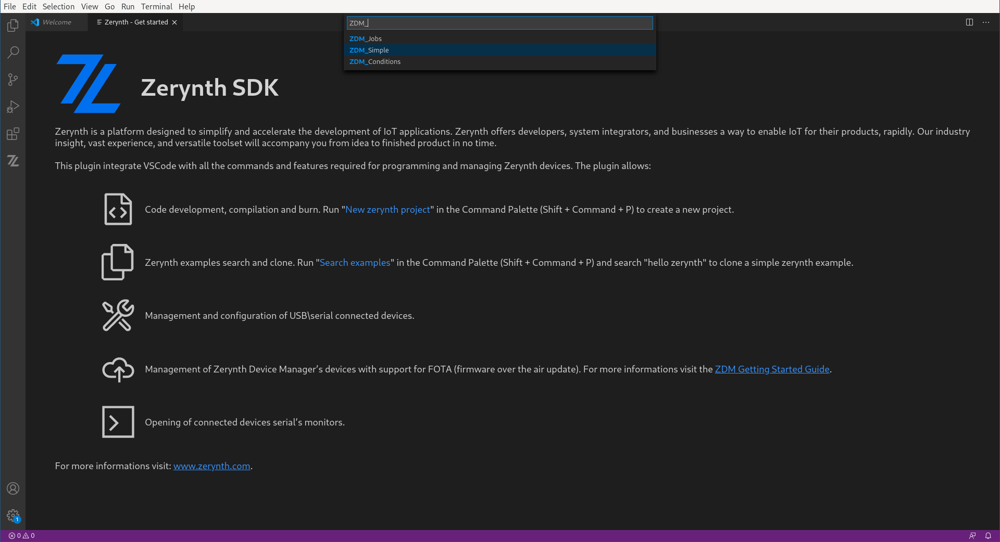
  </a>
</figure>

Congratulations, you created your first IoT project!

### Connect your Zerynth Hardware

The project is not ready yet, you need to add your wifi network name and password. You can do it easily by modifying the already opened file `main.py` (that by the way is the main entry point of every Zerynth firmware). The two variables are `ssid` and `passwd`, quite self explanatory.

Now that the project knows how to connect to your local network, we need to plug a Zerynth device to your USB port. It doesn't matter if the hardware you have is a [ZM1-DB](../hardware/ZM1-Development-Board.md) or the mighty [4ZeroBox](../hardware/4ZeroBox.md); the project will run on all of them seamlessy.

The only thing that you are required to do is to tell VSCode which kind of hardware you want to use! For this, just press the `Physical device` action in the `Zerynth Control Panel` on the left. VSCode will automatically recognize the device connected to your USB (when in doubt, VSCode will ask you to choose between different options) and configure the project accordingly. 

<figure>
  <a data-fancybox="gallery" href="img/project-03.png">
  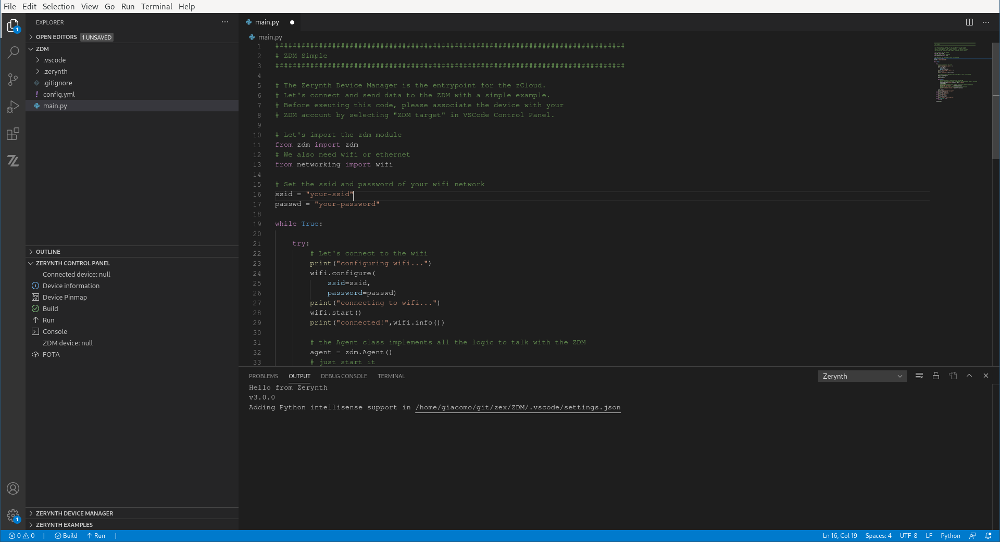
  </a>
</figure>

### Run the firmware

Time is ticking, just press `Run` in the `Zerynth Control Panel` and the project will be moved on your device and executed!
Ignore all the colorful messages for the moment and press `Console` in the `Zerynth Control Panel`. This will open the debug console of your device where you can inspect the device messages. If everything goes well, it will connect to your wifi network but will start printing out misterious messages about MQTT errors. Is this a bug?!? No, it's an advanced security feature! Read on.

<figure>
  <a data-fancybox="gallery" href="img/project-04.png">
  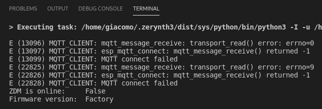
  </a>
  <figcaption>MQTT errors in not provisioned device</figcaption>
</figure>

## 3. Prepare the device for the cloud

IoT devices are not made only of hardware and firmware. They also have a unique cryptographic identity that links their physical existence with their virtual counterpart in the cloud. Yes, it's a lot, take a breath. Let's say that inside each and every Zerynth hardware there is a secret key protected by a somewhat magical secure element that says "hey, I am device xyz".

What is missing in the picture is some piece of information that says "physical device xyz belongs to you and in the cloud it's called my-device", namely the link between physical identity and cloud identity.

### The magic of zero touch provisioning

This information is generated in a step called **provisioning**. It must be done only once, it's just a click and gives you control over the device forever (or until you decide otherwise).

Just click `Provisioning` in the `Zerynth Control Panel`. You will be asked to create a cloud device, give it a name like `my-iot-device` and accept the confirmation dialog and wait a little.

<figure>
  
  <figcaption>Select a device to provision</figcaption>
</figure>
<figure>
  
  <figcaption>Accept the confirmation dialog</figcaption>
</figure>
<figure>
  
  <figcaption>Successful provisioning!</figcaption>
</figure>
<figure>
  
  <figcaption>Updated control panel</figcaption>
</figure>

Under the hood the magic has happened! The device is now linked to your account and nobody can claim it back.

!!! note
    If you need to use the same device in another account or workspace, right click on `Provisioning` and choose `Detach`. You can then provision the physical device again

If you now press `Cloud device` a page will be opened in your browser where you can inspect the cloud identity of your device and a lot more!

<figure>
  <a data-fancybox="gallery" href="img/project-08.png">
  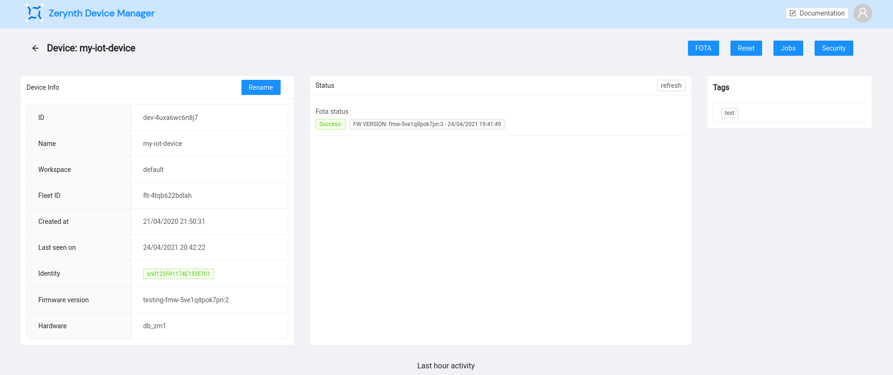
  </a>
  <figcaption>zDeviceManager device page</figcaption>
</figure>

## 4. Send data!

We are almost there! Now press `Run` again and execute the project on your device. This is needed because the provisioning step erased what you loaded before. Now press `Console` and check that the device now does not complain and is sending data to the cloud!

You can also go back to the web browser, scroll down and check the data incoming!

<figure>
  <a data-fancybox="gallery" href="img/project-09.png">
  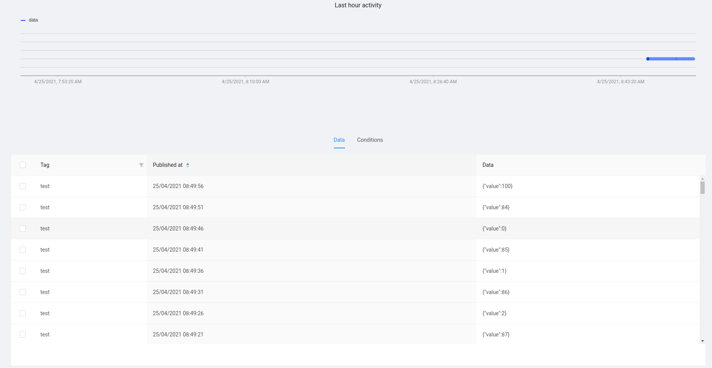
  </a>
  <figcaption>zDeviceManager device data console</figcaption>
</figure>

And as a final bonus, from the web browser, press the `Reset` button. It will send a reset request to the device that will, guess what, reset itself. 

After five minutes everything is in place: you have a securely connected device that is forever under your control; it sends data to the cloud but can also receive request from it!

You can learn more at the following resources:

- [Tutorials](../tutorials/index.md)
- [Technical reference](../reference/index.md)
- [Hardware reference](../hardware/index.md)

## Zerynth eco-system

But IoT is not just sending data; how about industrial analog sensors, relays or communicating over RS485, RS232 or CAN?

Zerynth Development boards offer a game-changing standard for connecting and adding functionalities to your application via expansions.

Expansion boards vary in features and functionalities. Currently, Zerynth offers expansion boards for:

- [EXP-IO](../hardware/EXP-IO.md): Industrial in/out board with 4x Solid State Relays, 2x 4-20mA/0-10V/NTC channels, 2x opto-isolated digital inputs
- [EXP-RELAY](../hardware/EXP-RELAY.md): Relay board with 4 Power Relays.
- [EXP-SER](../hardware/EXP-SER.md): Serial Communication board offers : CAN, RS232 and RS485 
- [EXP-PROTO](../hardware/EXP-PROTO.md): Prototyping board for connecting and testing different types of sensors and devices.

Check our [hardware](../hardware/index.md) page for more details.
