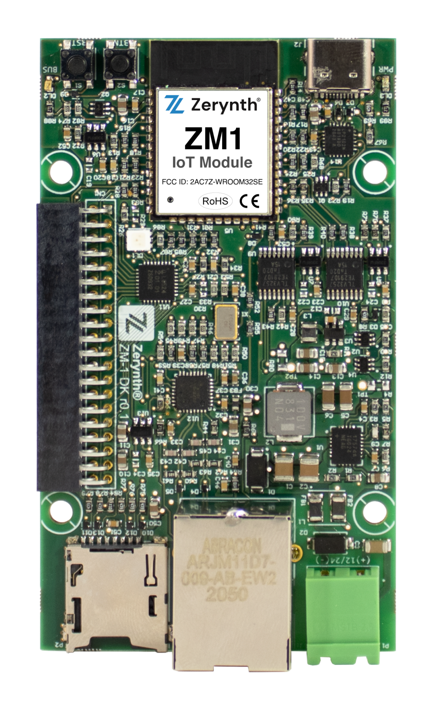
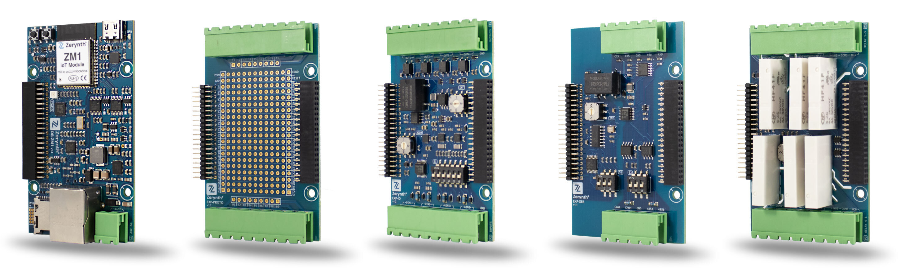

# Zerynth hardware platform

Easy-to-use hardware platform for creating Industrial IoT applications and connecting products to IoT, both in development and in production.

## Development Boards 

The ZM1-DB is a flexible, modular, development board that features the ZM1 SoM. With the integrated Zerynth software, It is ready for developing a prototype or a proof-of-concept right out of the box.

<figure>
  
</figure>

The ZM1-DB easily connects with the Zerynth expansion boards. The expansion system enables fast and efficient prototyping, and adding/removing functionalities in no time.

[Buy now at this link](https://zerynth.com/products)

For more information on the ZM1-DB, Please refer to [ZM1-DB Hardware page here](ZM1-Development-Board.md)

## Modular Expansion System
Zerynth Development boards offer a game-changing way of connecting and adding functionalities to your application in a simple and easy way.
The development board offers a modular expansion system that adds expansion boards through the connectors on the board (Z-bus).

<figure>
  
</figure>

Expansion boards vary in features and functionality. Currently, Zerynth offers expansion boards for :

* [EXP-IO](EXP-IO.md): Industrial input/output board with 4 solid-state relays, 2 analog channels (4-20mA/0-10V/NTC/current clamp) channels, 2 opto-isolated digital inputs
* [EXP-RELAY](EXP-RELAY.md): Relay board with 6 Electromechanical power relays rated 6A 250VAC.
* [EXP-SER](EXP-SER.md): Serial Communication board with : CAN, RS232 and RS485  interfaces.
* [EXP-PROTO](EXP-PROTO.md): Prototyping board for connecting and testing different types of sensors and devices.

## 4ZeroBox

Industrial IoT device for acquisition, monitoring and control of industrial machines
4ZeroBox is a versatile data acquisition unit, designed to be integrated into both legacy and modern industrial machines. The 4ZeroBox easily improves visibility on production processes, enables predictive maintenance of machines, and performs power management monitoring. 

<figure>
  
</figure>

The 4ZeroBox modernizes any industrial machinery and equipment allowing companies to drive their Industry 4.0 digital transformation.

[Buy now at this link](https://zerynth.com/products)

You can find more info about 4ZeroBox [here](4ZeroBox.md).
