# Development Environment

Zerynth SDK offers a rich development environment. Firmware can be written, compiled and run with a set of flexibile tools.
The editor of choice is [Visual Studio Code](https://code.visualstudio.com) (VSCode, version 1.51 or higher) that is installed automatically with the SDK together with its [Zerynth Extension](https://marketplace.visualstudio.com/items?itemName=zerynth.zerynth3). 

However, since all the operations required for compiling and running a firmware are performed via a [command line interface](../cli/ztc/index.md), any editor can be used with any build system with some ad hoc configuration.

## What is installed

Once the **Zerynth SDK** is installed, a Zerynth folder is created containing all the required components. Depending on the platform the zerynth folder can be found:

* under `~/.zerynth3` for Mac and Linux
* under `C:\Users\<username>\zerynth3` on Windows 10

The SDK contains:

* A stripped down version of Python 3.8 for running the Zerynth toolchain
* GCC based compilers for all the Zerynth hardware
* Python and C libraries
* Board support packages (`bsp`) for Zerynth hardwares
* An extensive set of examples
* The command line interface
* The latest version of VSCode if not already installed

At the end of installation, the `PATH` environment variable is modified to point to relevant Zerynth executables that are therefore immediately available from any terminal:

* `ztc` will run the [Zerynth Toolchain CLI](../cli/ztc/index.md)
* `zdm` will run the [Zerynth Device Manager CLI](../cli/zdm/index.md)
* `zstudio` will run VSCode

!!! note
    If a version of Zerynth before v3.0.0 is detected, there may be a clash between the old `ztc` and `zdm` commands. In that case, the `ztc3` and `zdm3` commands can be used in their place to maintain compatibility.

## VSCode Extension

The VSCode Zerynth extension can be installed together with the SDK or can be installed from the [Azure marketplace](https://marketplace.visualstudio.com/items?itemName=zerynth.zerynth3). The end result is the same and in both cases the full SDK is downloaded and installed.

Upon startup the Zerynth extension shows the greeting panel with some getting started instructions
<figure>
  <a data-fancybox="gallery" href="img/vscode-startup.png">
  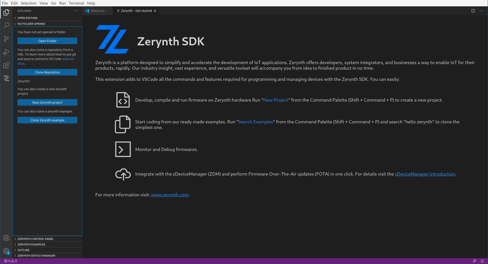
  </a>
</figure>

By opening the explorer panel, the option to start a new Zerynth project is given, either from scratch or by cloning an existing example.

### Cloning an example

The easiest way to setup a new project is to clone an example. It can be done either from the `Clone Zerynth Example` button or from the `Zerynth Examples` panel. Clicking the `Clone Zerynth Example` button starts a popup for searching the installed examples. Typing something and hitting enter shows the matches:

<figure>
  <a data-fancybox="gallery" href="img/vscode-clone-example.png">
  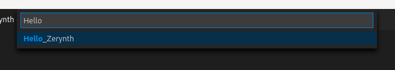
  </a>
</figure>

After selecting an example, a folder where to clone it must be chosen

### Running a project

Once the example is cloned, VSCode shows a set of panels and terminals that are useful for working with the current project.

<figure>
  <a data-fancybox="gallery" href="img/vscode-project-opened.png">
  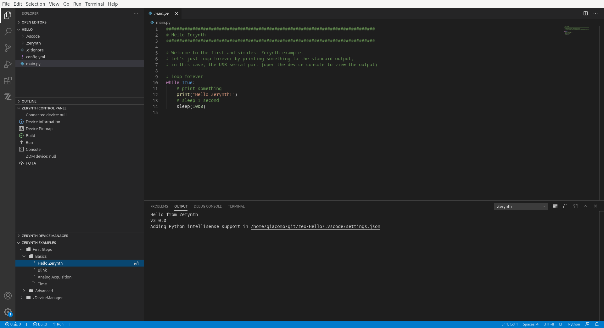
  </a>
</figure>

In the top half of the screen VSCode shows the source code of the project, represented by the file `main.py`. On the left, there are many panels, some are provided by VSCode, some by the Zerynth extension. In particular, the `Zerynth Control Panel` contains shortcuts to all the operations required to run a connected device.

<figure>
  <a data-fancybox="gallery" href="img/vscode-zerynth-control-panel.png">
  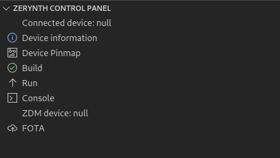
  </a>
</figure>

In order to compile and run a project, a device must be first plugged in to a USB port. By pressing `Physical device` in the `Zerynth Control Panel` the device is automatically recognized and the project configured accordingly. 

!!! note
    Not all Zerynth hardwares can be automatically recognized. In that case, VSCode will present a popup where the correct device can be chosen

<figure>
  <a data-fancybox="gallery" href="img/vscode-connect-device.png">
  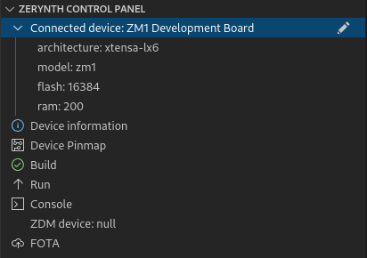
  </a>
</figure>

By clicking on `Device documentation` and `Device Pinmap` the documentation pages for the device datasheet and schematics are opened in the browser. Before opening the pages, VSCode will ask to trust the link; it is recommended to set `zerynth.com` as a trusted domain in VSCode so that all pages will be opened without confirmation.

By clicking `Build` the project is compiled. The output of compilation is shown in the terminal window named `Task - Build`. 

<figure>
  <a data-fancybox="gallery" href="img/vscode-build.png">
  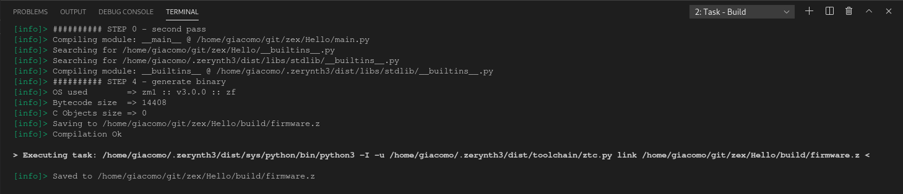
  </a>
</figure>

After a successful compilation two new directories appear in the project: `build` and `cache`. The former stores the result of a compilation, namely the file `firmware.z`; the latter stores temporary files to speed up subsequent compilations. 

<figure>
  <a data-fancybox="gallery" href="img/vscode-build-result.png">
  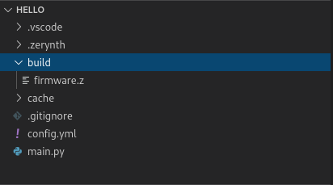
  </a>
</figure>

By clicking `Run` in the `Zerynth Control Panel`, the project is compiled and flashed on the connected device. The result of the `Run` operation is reported in the terminal window named  `Task - Run`.

<figure>
  <a data-fancybox="gallery" href="img/vscode-run-result.png">
  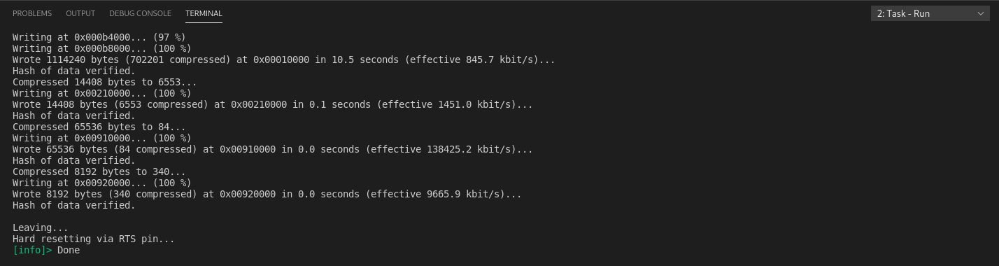
  </a>
</figure>

### Debugging a project

Once the firmware is running on the device, it is possible to monitor its execution by opening the device `Console`. It establishes a serial communication over USB and shows the output of the firmware.

<figure>
  <a data-fancybox="gallery" href="img/vscode-console.png">
  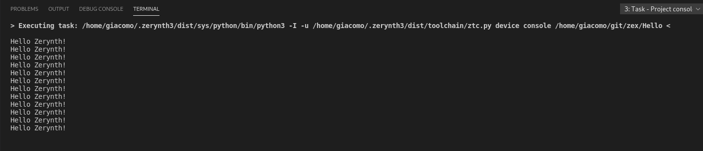
  </a>
</figure>

Sometime a firmware may throw an exception which is shown in the console and recognized. By clicking on the `Problems` tab the list of problems is shown together with their location in the code.

<figure>
  <a data-fancybox="gallery" href="img/vscode-problems.png">
  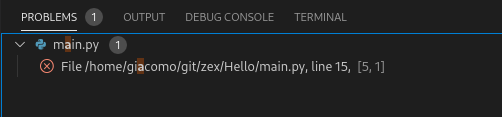
  </a>
</figure>

#### Advanced Debugging

The firmware can print to the console or not depending on the chosen debug level. By default the debug level is disabled and the only way to output something to the console is by using `print` in the program. However, Zerynth allows the usage of additional keywords whose output is printed to the console conditionally. The keywords are `zinfo`, `zwarn`, `zerror` and `zdebug`. To enable the corresponding debug level, the project contains a configuration file called `config.yml`. Inside `config.yml` the configuration parameter `ZERYNTH_DEBUG` can be enabled and set to one of four levels:

* `info`: `zinfo` keyword is effective, all the other keywords are disabled
* `warning`: `zinfo` and `zwarn` keywords are effective, all the other keywords are disabled
* `error`: `zdebug` is disabled, all the other keywords are effective
* `debug`: all keywords are effective

### Provisioning the device

Provisioning is a very important step that must be performed just once, before connecting any device to the Zerynth Device Manager. It consists of associating the device physical identity protected by the secure element with the device identity on the Zerynth Device Manager. This step guarantees that the physical device is owned only by the Zerynth account that performs the associations.

Under the hood the physical device is loaded with a provisioning firmware that generates a signature by exploiting the capabilities of the secure element. 
The signature is then sent to the zDeviceManager that, after verifying its authenticity, associates the physical identity with a zDeviceManager device. The association is possible if the physical device is not already associated. In that case it must be deassociated first.

Once associated, the device can connect to the zDeviceManager and begin to send data to the corresponding workspace.

All the steps above can be performed with a single click on the edit icon of the `Provisioning` in the `Zerynth Control Panel`. A popup window will be shown for selecting the zDeviceManager device to associate with the physical one. If no devices are present in the workspace, one can be created from the VSCode popup.

<figure>
  <a data-fancybox="gallery" href="img/vscode-provisioning-01.png">
  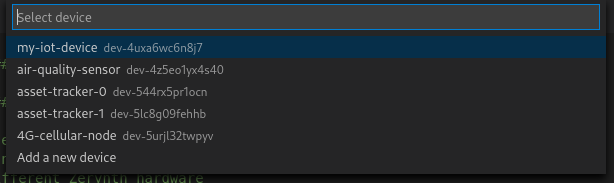
  </a>
  <figcaption>Select a device to provision</figcaption>
</figure>
<figure>
  <a data-fancybox="gallery" href="img/vscode-provisioning-02.png">
  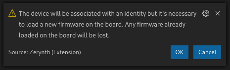
  </a>
  <figcaption>Accept the confirmation dialog</figcaption>
</figure>
<figure>
  <a data-fancybox="gallery" href="img/vscode-provisioning-03.png">
  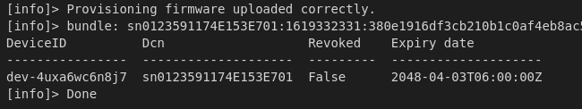
  </a>
  <figcaption>Successful provisioning!</figcaption>
</figure>
<figure>
  <a data-fancybox="gallery" href="img/vscode-zerynth-control-panel-with-device.png">
  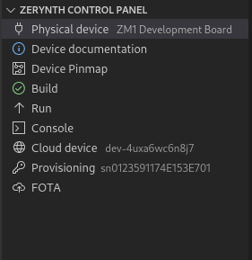
  </a>
  <figcaption>Updated control panel</figcaption>
</figure>

Once a device is correctly provisioned, any project or example connecting to the zDeviceManager will work out of the box.
By clicking `Cloud Device` in the `Zerynth Control Panel`, the zDeviceManager device page is opened in the browser,
showing the device info.

### Performing Over the Air Update (FOTA)

When the device is connected to the zDeviceManager it is always possible to update the firmware remotely by sending a FOTA request. The device will download the new firmware and install it. Upon reset, the new firmware will validate itself and if everything works correctly, it becomes permanent. FOTA can be easily tested directly from VSCode by clicking `FOTA` in the `Zerynth Control Panel`; the current project is compiled and the `firmware.z` is uploaded to the zDeviceManager as a new firmware version. The `FOTA` request is sent to the device automatically and by opening the console, its progress can be monitored.

More details on FOTA can be found [here](../../zCloud/FOTA.md).

### Shortcuts

All the commands of the extension can be run from VSCode command palette. Just press `Ctrl+Shift+P` and type one of the following (or just part of it until it appears in the dropdown):

- `Zerynth > Login`, start login
- `Zerynth > New Zerynth project`, creates a new Zerynth project with some default folders and files:
    + .vscode, a folder containing the project workspace settings;
    + .zerynth, required by Zerynth;
    + main.py, the firmware main python file;
    + readme.md, a description file initially filled with creation date;
    + .gitignore, ignore SDK temporary files;
    + config.yml, a configuration file for firmware macros and settings.
- `Zerynth > Clone Example`, clone a Zerynth example into a new project.
- `Zerynth > Search Examples`, search examples based on their content
- `Zerynth > Set Device Type`, set the type of the physical device connected to the USB port
- `Zerynth > Device Pinmap`, opens the device schematics in the browser
- `Zerynth > Device Documentation`, opens the device documentation in the browser
- `Zerynth > Compile`, produces an executable bytecode file compiling the current project for the physical device
- `Zerynth > Run`, run the bytecode on the physical device
- `Zerynth > Console`, open the serial port monitor for the physical device
- `Zerynth > Attach to ZDM`, attach the physical device to a zDeviceManager device identifier
- `Zerynth > Device Provisioning`, attach the physical device credentials contained in the secure element to a zDeviceManager device identifier
- `Zerynth > Detach from ZDM`, detach the physical device credentials from the zDeviceManager device identifier
- `Zerynth > FOTA`, prepare the current project for over the air update and send the update to the device
- `Zerynth > Go To ZDM`, open the zDeviceManager web app
- `Zerynth > Device Page`, open the device page on the zDeviceManager web app
- `Zerynth > Add Workspace`, create a new workspace in the zDeviceManager
- `Zerynth > Add Fleet`, create a new fleet of inside a zDeviceManager workspace
- `Zerynth > Add Device`, create a new device of inside a zDeviceManager fleet
- `Zerynth > Logout`, log out

