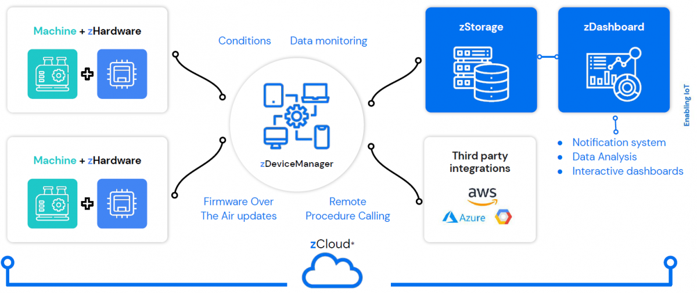

# Introduction to zCloud

The Internet of Things is all about extracting valuable data from billions of connected devices. The task is made complex by the need of taking care of the security of your fleets, the scalability of your services and the safety of your data.

**zCloud** is the platform that frees you from the burden of maintaining all the technology and infrastructure, while focusing on the added value of IoT data.
Zerynth Cloud is a complete platform designed for IoT applications.
From a single interface, manage IoT devices, store and visualize data, and gain insights.

## **zCloud** is composed of

* **Device Management**: anything from securely provisioning devices, updating and configuring them remotely is the task of the [zDeviceManger](zdm_intro.md) and its [Over the Air Update](FOTA.md) capabilities.
* **Data Storage**: IoT data needs to be stored, recovered from accidental corruption and easily accessed for analysis and integration. The [zStorage](zstorage_intro.md) service has been developed with these goals in mind.
* **Dashboarding**: no better tool than a properly designed dashboard can help extract useful insights from IoT data. The [zDashboard](zdashboard_intro.md) service allows hosting and serving multiple customizable dashboards getting data directly from the zStorage.

<figure>
  
</figure>

